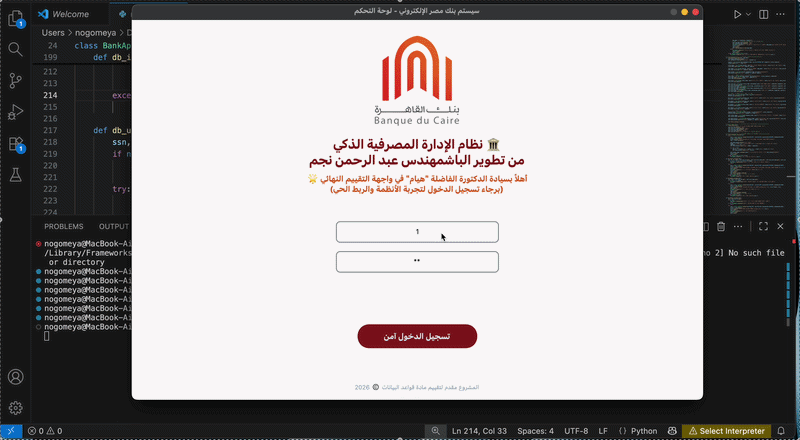
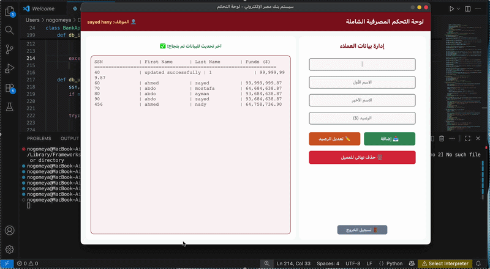
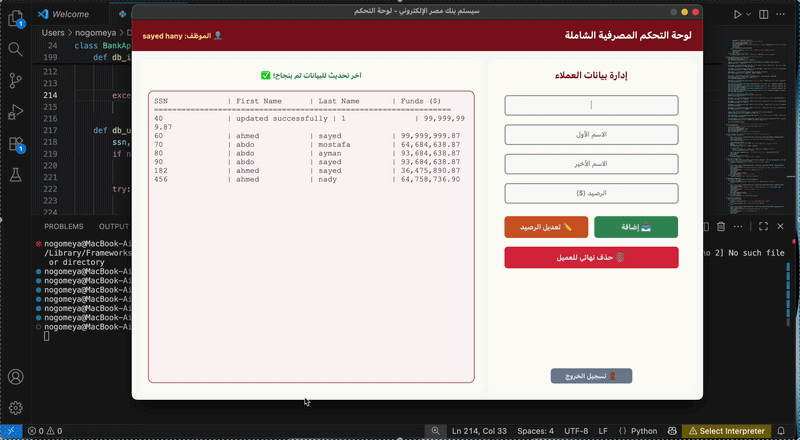

# Final_DB_Project

This is the required final project for the Database Systems course at BSNU, under the supervision of **Dr. Amira Mohy** and the teaching assistant **Hayam Mohamed**.

## Project Overview
This project was developed using **MySQL** and includes the implementation of SQL concepts studied during the course.

A database named **Bank** was created, and the database structure was designed and implemented using:

- **DDL (Data Definition Language)** commands
- **DML (Data Manipulation Language)** commands
- **DQL (Data Query Language)** commands

The project demonstrates different SQL operations and database management concepts covered throughout the semester.

## Documentation
A detailed report was prepared containing:

- Full project details
- SQL commands used in the project
- Explanations of database operations
- Screenshots demonstrating the execution of SQL queries and commands

## GUI Implementation
A graphical user interface (**GUI**) was also developed using **Python** to provide an interactive and user-friendly way to interact with the database system.

## Shots from my projects 

## 🎬 DML IN GUI
1- insert 

## 
2- updae 

## 
3- delete 

